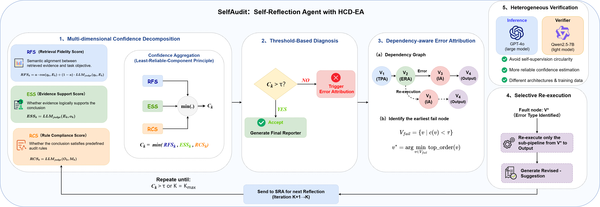

# SelfAudit: Heterogeneous Multi-Dimensional Reflection for Complex Document Auditing

[](https://www.python.org/downloads/)
[](https://opensource.org/licenses/MIT)

Official implementation of **"SelfAudit: Heterogeneous Multi-Dimensional Reflection for Complex Document Auditing"**.

SelfAudit is a reflection-driven multi-agent framework that audits complex documents (contracts, legal agreements, corporate reports) through four specialized agents and a Heterogeneous Multi-Dimensional Confidence Decomposition with Dependency-Aware Error Attribution (HCD-EA) mechanism.

## Framework


The auditing pipeline consists of four specialized agents:

- **TPA** (Task Planning Agent): Decomposes complex audit queries into structured subtasks represented as `(objective, rule, audit-point)` triples, aligning each with the corresponding auditing rules.
- **ERA** (Evidence Retrieval Agent): Constructs a hierarchical semantic tree from document structure, performs hybrid semantic + keyword retrieval with fusion reranking, and preserves structural metadata for cross-section evidence localization.
- **IA** (Inspector Agent): Conducts multi-dimensional verification across four dimensions — D1: Numerical Correctness, D2: Content Completeness, D3: Semantic Consistency, D4: Risk Analysis.
- **SRA** (Self-Reflection Agent): The core contribution. Equipped with HCD-EA, it monitors intermediate outputs at each stage and triggers feedback-driven selective re-execution when confidence falls below the threshold.

## HCD-EA Mechanism



The HCD-EA reflection mechanism operates in three stages:

**Multi-Dimensional Confidence Decomposition**: SRA estimates a three-dimensional confidence vector `(RFS, ESS, RCS)`:

- **RFS** (Retrieval Fidelity Score): `α · cos(Embed(q_k), Embed(E_k)) + (1-α) · LLM_judge(q_k, E_k)`, where α = 0.5
- **ESS** (Evidence-Support Score): Measures logical entailment from evidence to conclusion
- **RCS** (Rule-Compliance Score): Checks each applicable rule against the conclusion

Aggregate confidence: `c_k = min(RFS, ESS, RCS)`, reflecting the auditing principle that a conclusion is only as reliable as its weakest component.

**Dependency-Aware Error Attribution**: When `c_k < τ` (τ = 0.75), SRA constructs a dependency graph `G = (V, E)` with four nodes (TPA → ERA → IA → Verdict), identifies the topologically earliest failing node, and re-executes only the affected sub-pipeline (selective re-execution, max K = 3 iterations).

**Heterogeneous Verification**: The main pipeline (TPA, ERA, IA) runs on GPT-4o, while SRA uses Qwen2.5-7B-Instruct as an independent verifier with different architecture and training data, avoiding circular self-evaluation.

## Quick Start

### Prerequisites

- Python 3.11+
- OpenAI API key (GPT-4o backbone)
- DashScope API key (Qwen2.5-7B heterogeneous verifier)

### Installation

```bash
git clone <repository-url>
cd selfAudit

pip install -r requirements.txt

cp .env.example .env
# Edit .env with your API keys
```

### Download Datasets

```bash
python scripts/download_datasets.py
```

Downloads ContractNLI and CUAD from HuggingFace. LegalBench-RAG requires manual setup (see `data/README.md`).

### Run Experiments

```bash
# Main ContractNLI benchmark (Table 1) — 14 methods
python scripts/run_contractnli.py

# CUAD benchmark (Table 2) — 5 methods
python scripts/run_cuad.py

# LegalBench-RAG retrieval evaluation (Table 6)
python scripts/run_legalbench_rag.py

# Ablation studies (Tables 3, 4)
python scripts/run_ablation.py

# Cross-model robustness (Table 5)
python scripts/run_robustness.py

# Parameter sensitivity (tau, K)
python scripts/run_parameter_sensitivity.py

# Computational efficiency (Table 8)
python scripts/run_efficiency.py
```

## Configuration

All parameters are configured via `.env` file:

| Parameter | Default | Description |
|-----------|---------|-------------|
| `LLM_MODEL` | `gpt-4o` | Backbone model for TPA, ERA, IA |
| `HETEROGENEOUS_LLM_MODEL` | `qwen2.5-7b-instruct` | Heterogeneous verifier for SRA |
| `EMBEDDING_MODEL` | `text-embedding-3-large` | Embedding model (3,072-dimensional) |
| `HCD_TAU` | `0.75` | Confidence threshold (calibrated on 200 held-out ContractNLI samples) |
| `HCD_K` | `3` | Max HCD-EA reflection iterations |
| `HCD_ALPHA` | `0.5` | RFS interpolation weight |
| `ERA_TOPK` | `10` | Number of evidence chunks retrieved |
| `LLM_TEMPERATURE` | `0` | LLM temperature |
| `BACKBONE_LIST` | `["gpt-4o", "qwen2.5-72b-instruct", "llama-3.3-70b-instruct", "deepseek-chat"]` | Backbones for cross-model robustness |

## Project Structure

```
selfAudit/
├── app/
│   ├── core/config.py              # Pydantic settings
│   ├── services/
│   │   ├── llm/                    # LLM service + prompt templates
│   │   ├── embedding/              # text-embedding-3-large client
│   │   ├── retrieval/              # ERA pipeline
│   │   │   ├── hierarchical_tree.py
│   │   │   ├── hybrid_index.py     # Dense + BM25 hybrid index
│   │   │   ├── fusion_reranker.py  # RRF fusion + rerank
│   │   │   └── era_retriever.py
│   │   ├── rerank/                 # Rerank client
│   │   └── verifier/
│   │       ├── dependency_graph.py # G = (V, E) for error attribution
│   │       └── heterogeneous.py    # Qwen2.5-7B independent verifier
│   ├── graphs/selfAudit/
│   │   ├── selfaudit_graph.py     # LangGraph StateGraph assembler
│   │   ├── state/audit_state.py   # AuditState TypedDict
│   │   └── nodes/
│   │       ├── tpa_node.py        # Task Planning Agent
│   │       ├── era_node.py        # Evidence Retrieval Agent
│   │       ├── ia_node.py         # Inspector Agent (D1-D4)
│   │       └── sra_node.py        # Self-Reflection Agent (HCD-EA)
│   ├── schemas/                    # Pydantic data schemas
│   └── utils/
│       ├── metrics.py              # All evaluation metrics
│       ├── dataset_utils.py        # Dataset loaders
│       └── value_parser.py         # JSON extraction from LLM output
├── experiments/                    # Experiment runners
├── scripts/                        # Entry point scripts
├── image/                          # Architecture and HCD-EA diagrams
└── data/                           # Dataset directory
```

## Reproduced Tables

| Table | Description | Script |
|-------|-------------|--------|
| Table 1 | ContractNLI main results | `scripts/run_contractnli.py` |
| Table 2 | CUAD results | `scripts/run_cuad.py` |
| Table 3 | Agent ablation | `scripts/run_ablation.py` |
| Table 4 | HCD-EA component ablation | `scripts/run_ablation.py` |
| Table 5 | Cross-model robustness | `scripts/run_robustness.py` |
| Table 6 | LegalBench-RAG retrieval | `scripts/run_legalbench_rag.py` |
| Table 7 | Confidence decomposition | (logged during SRA execution) |
| Table 8 | Computational efficiency | `scripts/run_efficiency.py` |

## Baselines

SelfAudit is compared against 13 baselines across four categories:

**Prompting**: Zero-shot (ZS), Few-shot (FS)

**Reasoning**: Chain-of-Thought (CoT), Self-Consistency, ReAct

**Retrieval-augmented**: Standard RAG, Self-RAG

**Reflection-based**: Reflexion, Self-Refine, CRITIC

**Multi-agent**: AutoGen, MetaGPT, PAKTON

All baselines use GPT-4o as the backbone model for fair comparison.

## Citation

```bibtex
@article{chen2026selfaudit,
  title={SelfAudit: Heterogeneous Multi-Dimensional Reflection for Complex Document Auditing},
  author={Chen, Fei and Zhang, Chenyu and Jiang, Meng and Chen, Yun},
  journal={Applied Sciences},
  year={2026}
}
```

## License

MIT License.

## Acknowledgments

We thank the authors of ContractNLI, CUAD, and LegalBench-RAG for making their datasets publicly available.